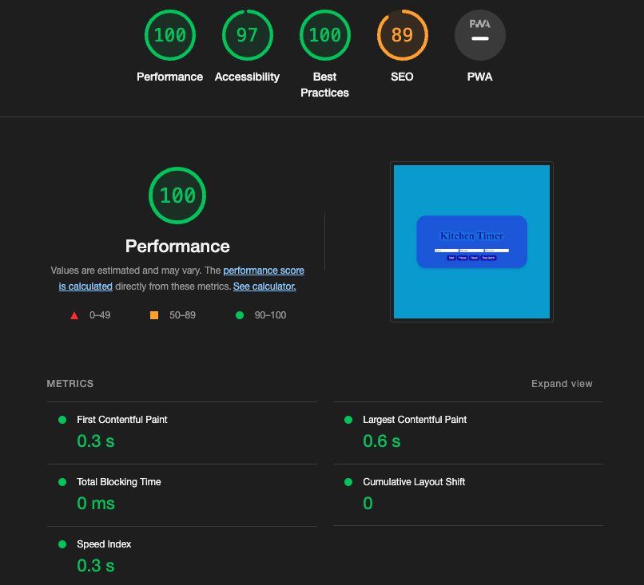
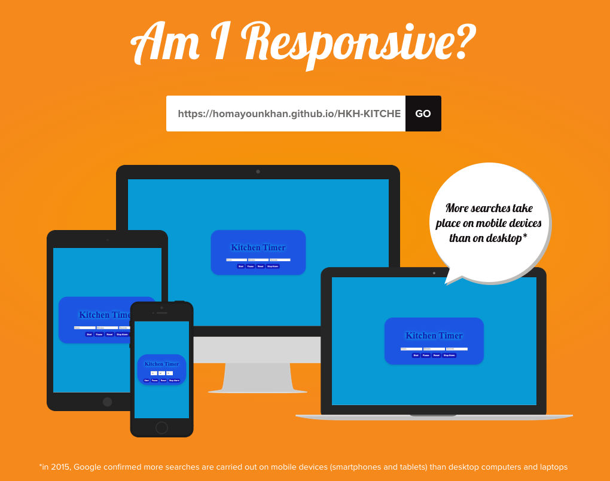

# ⏲️ Kitchen Timer

A simple and user-friendly **web-based kitchen timer** designed to help you keep track of time while cooking or performing other tasks. Built with **HTML**, **CSS**, and **JavaScript**.

---

---

## ✨ Features

- **Responsive Design:** The timer interface adapts smoothly to different screen sizes, perfect for both desktop and mobile devices.  
- **Flexible Input:** Enter any number of hours, minutes, and seconds — the timer automatically converts your input into the correct format.  
- **Alarm Notification:** When the timer reaches zero, a clear alarm sound will notify you.

---

---

## ▶️ How to Use

1. Open the `index.html` file in your favorite web browser.  
2. Input the desired **hours**, **minutes**, and **seconds** in the respective fields.  
3. Click the **Start** button to begin the countdown.  
4. Use the **Pause**, **Reset**, or **Stop Alarm** buttons as needed.

---

## 🗂️ Project Structure

- `index.html`: Main HTML file that holds the timer’s structure.  
- `styles.css`: CSS file for styling the timer interface.  
- `script.js`: JavaScript file handling the timer logic and user interactions.

---

## 🧪 Browser Testing

This project has been tested and works well on these browsers:  
- Google Chrome  
- Mozilla Firefox  
- Microsoft Edge  

Simply open `index.html` in your preferred browser and try out the timer.

---

## 🐞 Known Issues

Currently, there are no known bugs. If you find any, please report them in the project’s issue tracker.

---

## ✅ Validation

Both the HTML and CSS files have passed validation with no errors or warnings using the [W3C Markup Validation Service](https://validator.w3.org/).

---

## ⚠️ Disclaimer

This project is built for **educational purposes only** and is **not intended for commercial use**.

---

## 🙌 Credits

This web application was entirely created by **Homayoun Khanmohammadi**. All rights reserved.
