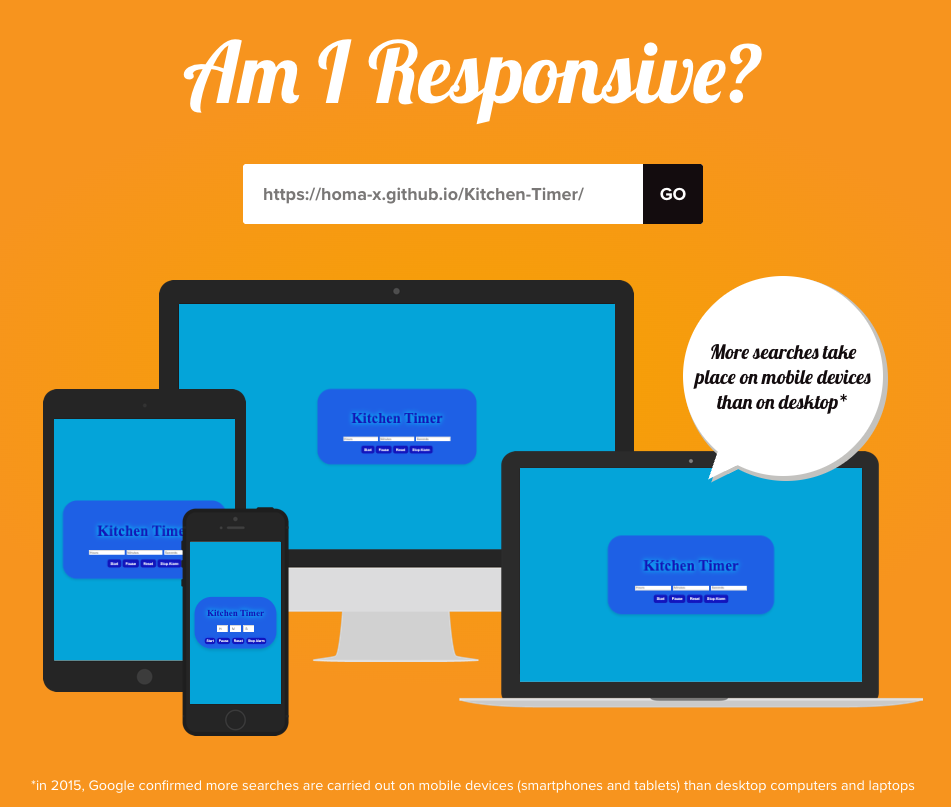

# 🍳 Kitchen Timer

A simple and user-friendly web-based kitchen timer built with HTML, CSS, and JavaScript. Perfect for keeping track of cooking or other timed tasks.

## ✨ Features

- **Responsive Design:** Works smoothly on both desktop and mobile devices.
- **Flexible Input:** Enter any number of hours, minutes, and seconds; the timer converts and handles the input correctly.
- **Alarm:** A sound alarm plays when the timer reaches zero.
- **Controls:** Start, pause, reset, and stop alarm functionalities.

## 🚀 How to Use

1. Open the `index.html` file in your preferred web browser.
2. Input desired hours, minutes, and seconds.
3. Click **Start** to begin the countdown.
4. Use **Pause**, **Reset**, or **Stop Alarm** buttons as needed.

## 📂 Project Structure

- `index.html` – The main HTML page.
- `styles.css` – CSS for styling the timer interface.
- `script.js` – JavaScript code handling timer logic and user interactions.

## 🧪 Tested On

- Google Chrome  
- Mozilla Firefox  
- Microsoft Edge  

Simply open `index.html` on any of these browsers to test the timer.

## 🐞 Known Issues

Currently, no known bugs. If you find any, please open an issue in the repository.

## ✅ Validation

HTML and CSS files have been validated via [W3C Validator](https://validator.w3.org/) with no errors or warnings.

## ⚠️ Note

This project is for educational purposes only and not intended for commercial use.

## 👨‍💻 Author

Created by Homayoun Khanmohammadi. All rights reserved.

---

🔗 [Live Demo](https://homa-x.github.io/Kitchen-Timer/)  
🔗 [GitHub Repository](https://github.com/Homa-X/Kitchen-Timer)
